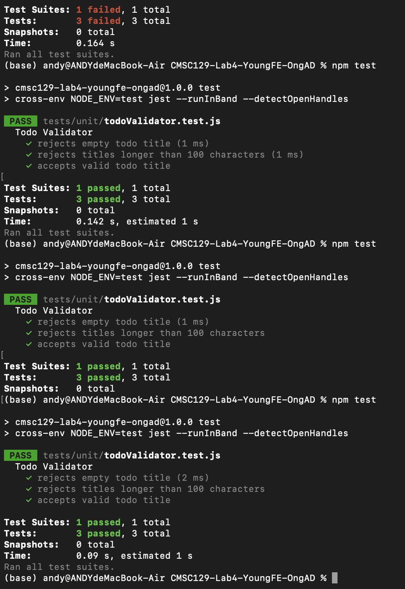

# CMSC129-Lab4-YoungFE OngAD

A lightweight, single-resource Todo List web application built using Test-Driven Development (TDD) principles following the Red-Green-Refactor cycle.

---

## 📋 User Stories

*   **User Story 1 (Create):** As a busy user, I want to type a task title and submit it, So that I can securely store the item in my daily list without forgetting it.
*   **User Story 2 (Update):** As a meticulous user, I want to check or mark a specific task as done, so that I can visually differentiate my unfinished responsibilities from completed work.
*   **User Story 3 (Delete):** As a minimalist user, I want to click a delete button next to an existing task item, so that I can instantly clear clutter from my display once a task is no longer relevant.

---

## 🎯 Testing Strategy

This project utilizes a multi-tiered automated testing hierarchy following the classic Software Testing Pyramid to ensure full feature compliance without implementation leakage.

### 1. Unit Tests (Isolated Core Logic)
Unit tests evaluate isolated pure business logic functions without initializing network ports, HTTP wrappers, or DOM states.
*   `validateTodo(title)`: Asserts whether an inputted task title string satisfies data validation constraints (e.g., handles empty string strings, spaces, and boundary character caps).
*   `createTodo(title)`:  Verifies that when a valid title is successfully processed, the resulting task entity object is automatically initialized with correct default properties.
*   `toggleTodo(todo)`: Asserts state transformation by accepting a target todo object and returning a new record clone with done flipped.

### 2. Integration Tests (Network Request/Response Cycles)
Integration tests verify communication paths and boundaries across the Express application router instance using memory mappings.
*   `POST /api/tasks`: create a task (happy path + validation). Asserts full validation behavior. Valid request payloads must return an explicit HTTP `201 Created` status along with the record object; malformed entities must yield a `400 Bad Request` status.
*   `GET /api/tasks`: Evaluates the pipeline's storage integration loop, asserting that a request returns an HTTP `200 OK` status and a comprehensive array reflecting all active tasks stored in-memory.

### 3. System Tests (End-to-End User Journeys)
System tests simulate black-box end-user behaviors by automating a browser instance via Cypress. Every user story maps directly to an E2E spec execution file:
*   `Create Journey`: 
*   `Toggle Journey`:
*   `Delete Journey`

---

## 🛠️ Tech Stack & Testing Tools

This application is built using a lightweight JavaScript ecosystem designed to run efficiently without the overhead of external database engines.

### 1. Core Application Stack
*   **Frontend Interface:** **React (Single Page Application)**
    *   *Role:* Manages the user interface, renders real-time state changes, and coordinates asynchronous HTTP communication with the backend.
*   **Backend Application Server:** **Node.js with Express.js**
    *   *Role:* Acts as a RESTful API gateway, processes routing logic, and orchestrates domain input validation.
*   **Data Persistence Layer:** **Server-Side In-Memory Storage**
    *   *Role:* Utilizes a native server-side global array (`let todos = [];`) to store task records. This guarantees rapid, isolated data resets between automated test configurations without requiring an external database connection.

### 2. Automated Testing Stack
*   **Unit Testing Tier:** **Jest**
    *   *Responsibility:* Asserts the deterministic behavior of pure domain business rules completely isolated from HTTP or browser execution environments.
*   **Integration Testing Tier:** **Jest + Supertest**
    *   *Responsibility:* Verifies complete HTTP request-response cycles. It tests Express route mappings, response payloads, and HTTP status codes.
*   **System / E2E Testing Tier:** **Cypress**
    *   *Responsibility:* Orchestrates an automated browser engine to execute complete user journeys, explicitly validating the 3 defined user stories from an end-user perspective.

---

## 📋 Setup Instructions

Follow these steps chronologically to pull down, install, and execute the repository environment locally or within automated CI runner containers.

### 1. Prerequisites
Ensure you have the following software runtimes installed on your local operating system:
*   **Node.js:** Version `20.x` or higher
*   **npm:** Version `10.x` or higher
*   **Git:** Accessible via CLI or GitHub Desktop

### 2. Repository Cloning & Workspace Setup
Clone the public repository to your local computer using your terminal or by opening the project URL inside GitHub Desktop:

```bash
# Clone the repository using the required naming convention
git clone [https://github.com/YOUR-GITHUB-USERNAME/CMSC129-Lab4-YoungFE-OngAD.git](https://github.com/YOUR-GITHUB-USERNAME/CMSC129-Lab4-YoungFE-OngAD.git)

# Move into the root project directory
cd CMSC129-Lab4-YoungFE-OngAD
```

---

## ✅ Unit Test Results

The following screenshot shows the successful execution of all unit tests for todo title validation.

# CMSC129-Lab4-YoungFE OngAD

A lightweight, single-resource Todo List web application built using Test-Driven Development (TDD) principles following the Red-Green-Refactor cycle.

---

## 📋 User Stories

*   **User Story 1 (Create):** As a busy user, I want to type a task title and submit it, So that I can securely store the item in my daily list without forgetting it.
*   **User Story 2 (Update):** As a meticulous user, I want to check or mark a specific task as done, so that I can visually differentiate my unfinished responsibilities from completed work.
*   **User Story 3 (Delete):** As a minimalist user, I want to click a delete button next to an existing task item, so that I can instantly clear clutter from my display once a task is no longer relevant.

---

## 🎯 Testing Strategy

This project utilizes a multi-tiered automated testing hierarchy following the classic Software Testing Pyramid to ensure full feature compliance without implementation leakage.

### 1. Unit Tests (Isolated Core Logic)
Unit tests evaluate isolated pure business logic functions without initializing network ports, HTTP wrappers, or DOM states.
*   `validateTodo(title)`: Asserts whether an inputted task title string satisfies data validation constraints (e.g., handles empty string strings, spaces, and boundary character caps).
*   `createTodo(title)`:  Verifies that when a valid title is successfully processed, the resulting task entity object is automatically initialized with correct default properties.
*   `toggleTodo(todo)`: Asserts state transformation by accepting a target todo object and returning a new record clone with done flipped.

### 2. Integration Tests (Network Request/Response Cycles)
Integration tests verify communication paths and boundaries across the Express application router instance using memory mappings.
*   `POST /api/tasks`: create a task (happy path + validation). Asserts full validation behavior. Valid request payloads must return an explicit HTTP `201 Created` status along with the record object; malformed entities must yield a `400 Bad Request` status.
*   `GET /api/tasks`: Evaluates the pipeline's storage integration loop, asserting that a request returns an HTTP `200 OK` status and a comprehensive array reflecting all active tasks stored in-memory.

### 3. System Tests (End-to-End User Journeys)
System tests simulate black-box end-user behaviors by automating a browser instance via Cypress. Every user story maps directly to an E2E spec execution file:
*   `Create Journey`: 
*   `Toggle Journey`:
*   `Delete Journey`

---

## 🛠️ Tech Stack & Testing Tools

This application is built using a lightweight JavaScript ecosystem designed to run efficiently without the overhead of external database engines.

### 1. Core Application Stack
*   **Frontend Interface:** **React (Single Page Application)**
    *   *Role:* Manages the user interface, renders real-time state changes, and coordinates asynchronous HTTP communication with the backend.
*   **Backend Application Server:** **Node.js with Express.js**
    *   *Role:* Acts as a RESTful API gateway, processes routing logic, and orchestrates domain input validation.
*   **Data Persistence Layer:** **Server-Side In-Memory Storage**
    *   *Role:* Utilizes a native server-side global array (`let todos = [];`) to store task records. This guarantees rapid, isolated data resets between automated test configurations without requiring an external database connection.

### 2. Automated Testing Stack
*   **Unit Testing Tier:** **Jest**
    *   *Responsibility:* Asserts the deterministic behavior of pure domain business rules completely isolated from HTTP or browser execution environments.
*   **Integration Testing Tier:** **Jest + Supertest**
    *   *Responsibility:* Verifies complete HTTP request-response cycles. It tests Express route mappings, response payloads, and HTTP status codes.
*   **System / E2E Testing Tier:** **Cypress**
    *   *Responsibility:* Orchestrates an automated browser engine to execute complete user journeys, explicitly validating the 3 defined user stories from an end-user perspective.

---

## 📋 Setup Instructions

Follow these steps chronologically to pull down, install, and execute the repository environment locally or within automated CI runner containers.

### 1. Prerequisites
Ensure you have the following software runtimes installed on your local operating system:
*   **Node.js:** Version `20.x` or higher
*   **npm:** Version `10.x` or higher
*   **Git:** Accessible via CLI or GitHub Desktop

### 2. Repository Cloning & Workspace Setup
Clone the public repository to your local computer using your terminal or by opening the project URL inside GitHub Desktop:

```bash
# Clone the repository using the required naming convention
git clone [https://github.com/YOUR-GITHUB-USERNAME/CMSC129-Lab4-YoungFE-OngAD.git](https://github.com/YOUR-GITHUB-USERNAME/CMSC129-Lab4-YoungFE-OngAD.git)

# Move into the root project directory
cd CMSC129-Lab4-YoungFE-OngAD
```

---

## ✅ Unit Test Results

The following screenshot shows the successful execution of all unit tests for todo title validation.

